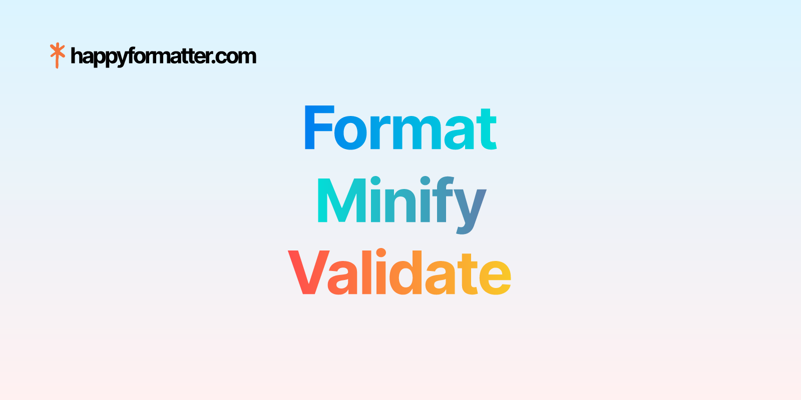

# HappyFormatter



**HappyFormatter** is a privacy-focused browser toolkit for formatting, minifying, inspecting, converting, and repairing developer snippets. It supports 39 formatter languages, 9 minifier targets, 29 utility tools, and SEO-focused workflow pages. Formatting and utility actions run locally in the browser, so pasted code stays on the user's device.

## Status

- **Production app**: Homepage-first local editor with fast textarea fallback while Monaco loads.
- **Editor**: Modern Monaco editor with Shiki grammars/themes, client-side models, and lazy language/theme loading.
- **Homepage**: Workflow, FAQ, directory, quick actions, and deferred editor startup are live.
- **Examples**: Formatter/minifier examples are statically highlighted with Shiki.
- **Analytics**: Small inline analytics shim with async GA loading. Partytown was removed to avoid worker/bootstrap overhead for one GA script.
- **OG images**: Static homepage preview at `public/images/og.png`; generated `/og/...` SVG and PNG routes for languages, tools, guides, errors, and comparisons.

## Features

- **39 Formatter Languages**: Broad coverage across web, data, runtime, systems, and document formats
- **9 Minifier Targets**: JavaScript, TypeScript, CSS, SCSS, HTML, JSON, GraphQL, Shell, and XML
- **29 Utility Tools**: JSON tools, converters, encoders/decoders, security utilities, color tools, text tools, time tools, and CSS utilities
- **Multiple Formatter Engines**: Prettier, Biome, Ruff, Mago, OXC, clang-format, shfmt, dprint, Taplo, Malva, web_fmt, and other WASM formatters
- **Zero Data Transmission**: Formatting, minification, and utility actions run client-side
- **Advanced Code Editor**: Powered by modern-monaco with Shiki syntax highlighting
- **Fast First Interaction**: The homepage editor shows an immediate textarea fallback and upgrades to Monaco shortly after load
- **Multiple Editor Themes**: GitHub, Dracula, Nord, Material, One Dark, Solarized, Monokai, Vitesse, Catppuccin, and more
- **Keyboard Shortcuts**: Quick formatting with `Ctrl+Shift+F` and minification with `Ctrl+Shift+M`
- **SEO Content System**: Tool hubs, guide pages, error pages, compare pages, generated metadata, and generated OG assets
- **Responsive Design**: Fully responsive interface optimized for desktop and mobile devices
- **Accessibility**: ARIA labels, keyboard navigation, screen reader affordances, and skip links

## Supported Languages

### Formatting Support

**Web Technologies**

- JavaScript (with minification) - _Alternatives: Biome and OXC formatters_
- TypeScript (with minification) - _Alternatives: Biome and OXC formatters_
- HTML (with minification)
- CSS (with minification)
- SCSS (with minification)
- Sass
- Less
- Vue
- Svelte
- Astro
- Angular templates
- Handlebars
- Jinja
- Twig

**Data, Markup, and Documents**

- JSON (with minification)
- JSONC
- JSON5
- XML (with minification)
- YAML
- TOML
- SQL
- GraphQL (with minification)
- Protocol Buffers (`.proto`)
- Markdown
- MDX

**Programming Languages**

- Python - _Alternative: Ruff formatter_
- Go
- Rust
- Shell (with minification)
- PHP - _Alternative: Mago formatter_
- Java
- Dart
- Lua
- Zig

**Systems Languages**

- C
- C++
- Objective-C
- Objective-C++
- C#

### Minification Support

The following languages support code minification:

- JavaScript
- TypeScript
- CSS
- SCSS
- HTML
- JSON
- GraphQL
- Shell
- XML

## Utility Tools

HappyFormatter includes 29 local utility tools grouped into 9 categories:

- **JSON Tools**: viewer, sort keys, diff, JSON to YAML, YAML to JSON, JSON to CSV
- **Web Encoding Tools**: Base64, URL encoder/decoder, regex tester
- **Data Converters**: CSV/TSV, CSV to JSON, TOML/JSON, XML to JSON
- **Security Utilities**: JWT decoder and hash generator
- **Color Tools**: color converter
- **Markup Tools**: Markdown preview, Markdown to HTML, HTML entities, SVG optimizer
- **Text Utilities**: text case, string escape, query string parser, HTTP header parser
- **Time Utilities**: Unix timestamp converter and cron expression explainer
- **CSS Utilities**: CSS unit converter

## Open Graph Images

- `public/images/og.png` is the main 1200x630 repository and homepage preview image.
- `public/images/happyformatter-workbench-reference.png` and `public/images/happyformatter-tools-reference.png` are reference screenshots for product surfaces.
- `/og/[...slug].svg` and `/og/[...slug].png` generate route-specific social cards for the homepage, tool hubs, language pages, guides, errors, and comparison pages.

## Getting Started

### Prerequisites

- **Node.js**: Version 18 or higher
- **Package Manager**: pnpm 11

### Installation

1. Clone the repository:

```bash
git clone https://github.com/happytoolin/happyformatter.git
cd happyformatter
```

2. Install dependencies:

```bash
pnpm install
```

3. Start the development server:

```bash
pnpm dev
```

4. Open [http://localhost:4321](http://localhost:4321) in your browser.

### Building for Production

```bash
pnpm build
pnpm preview
pnpm deploy
```

## Development

### Available Commands

```bash
pnpm dev              # Start development server
pnpm build            # Build for production
pnpm preview          # Preview production build
pnpm typecheck        # TypeScript type checking
pnpm check            # Astro checking
pnpm format           # Format code with dprint
pnpm deploy           # Deploy to Cloudflare Pages
```

### Project Structure

```text
src/
├── components/
│   ├── playground/      # Formatter workspace, Monaco editor, theme controls
│   ├── tools/           # Utility tool surfaces
│   ├── ui/              # Reusable UI components
│   ├── layout/          # Header, footer, head, layout
│   ├── info/            # Workflow, examples, related tools
│   └── faq/             # FAQ components
├── handlers/
│   ├── formatters/      # Language-specific formatter implementations
│   ├── minifiers/       # Language-specific minifier implementations
│   ├── utils/           # Handler utilities
│   └── interface.ts     # Formatter/minifier base classes
├── lib/
│   ├── languages.ts     # Language configuration and metadata
│   ├── utility-tools.ts  # Local utility tool definitions
│   ├── initialCode.ts   # Default code examples per language
│   ├── og-image.ts      # Generated OG SVG/PNG card rendering
│   ├── seo-content.ts   # Guides, errors, comparisons, and hub content
│   └── utils.ts         # General utilities
├── icons/               # SVG icon components
├── pages/               # Astro route pages
└── styles/              # Global CSS styles

public/
└── images/
    ├── og.png
    ├── happyformatter-workbench-reference.png
    ├── happyformatter-tools-reference.png
    └── happyformatter-logo-concept.png
```

## Technology Stack

- **Framework**: [Astro](https://astro.build) 6.4.4
- **Frontend**: React 19.2.7 with TypeScript 6.0.3
- **Styling**: Tailwind CSS v4.3.0
- **Code Editor**: modern-monaco with Shiki language grammars and themes
- **Syntax Highlighting**: Shiki for static examples and editor theme integration
- **State Management**: Zustand
- **Formatters**:
  - `@wasm-fmt/*` packages for C/C++, Dart, Go, GraphQL, Lua, Python, Shell, SQL, TOML, Web, YAML, Zig, and more
  - Biome (`@wasm-fmt/biome_fmt`) for JavaScript/TypeScript
  - OXC (`@wasm-fmt/oxc_fmt`) for JavaScript/TypeScript
  - Ruff (`@wasm-fmt/ruff_fmt`) for Python
  - Mago (`@wasm-fmt/mago_fmt`) for PHP
  - Malva (`@wasm-fmt/malva_fmt`) for CSS-family syntax
  - Prettier for JavaScript, TypeScript, JSON, Rust, and PHP paths
  - dprint for Markdown
  - xml-formatter for XML
- **Minifiers**:
  - `@swc/wasm-web` for JavaScript/TypeScript
  - `lightningcss-wasm` for CSS/SCSS
  - `html-minifier-terser` for HTML
- **Image Generation**: SVG/PNG OG routes backed by `sharp`
- **Deployment**: Cloudflare Pages

## Contributing

Contributions are welcome. Please test changes thoroughly before opening a pull request.

1. Fork the repository
2. Create a feature branch (`git checkout -b feature/amazing-feature`)
3. Make your changes and run the checks
4. Commit your changes
5. Push to the branch
6. Open a pull request

### Adding New Language Support

1. Create a formatter class in `src/handlers/formatters/[language].ts` extending `Formatter`
2. Create a minifier class in `src/handlers/minifiers/[language].ts` if minification is supported
3. Add the language configuration to `src/lib/languages.ts`
4. Add a Shiki language loader in `src/components/playground/CodePlayground.tsx`
5. Add a default code sample in `src/lib/initialCode.ts`
6. Update the formatter/minifier index in `src/handlers/index.ts`
7. Add SEO variant content if the language needs alternate route families

## License

This project is licensed under the **GPL-3.0 License**. See the [LICENSE](LICENSE) file for details.

## Acknowledgments

- [Astro](https://astro.build) - Static site framework
- [Monaco Editor](https://microsoft.github.io/monaco-editor/) and [modern-monaco](https://github.com/esm-dev/modern-monaco) - Browser editor runtime
- [Shiki](https://shiki.style/) - Syntax highlighting and editor themes
- WebAssembly formatters and minifiers from the open-source community

---

**HappyFormatter** - Format your code, keep it private.
